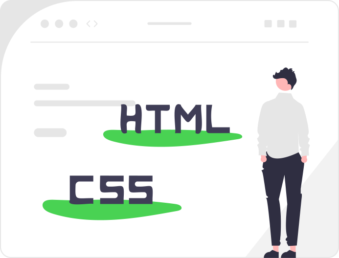

<!DOCTYPE html>
<html lang="ru">
<head>
    <meta charset="UTF-8">
    <meta name="viewport" content="width=device-width, initial-scale=1.0">
    <link rel="stylesheet" href="style.css">
    <title>Мой первый сайт</title>
</head>

<body>
    <h1 class="titl">Ксения Боровинских
     
Junior верстальщик</h1>
    
 

     

   <h3>Немного обо мне:</h3>

    Я начинающий специалист пао созданию сайтов. 
    Верстаю простые лендинги, 
    а также сложные сайты типа магазинов,корпоративных сайтов &#128139;

<h3>Почему лучше обратиться ко мне?</h3>

<h4>Правило четырёх В!</h4>
<ul>
<li>Верстка HTML/CSS/Javascript</li>
<li>Всегда не соблюдаю сроки</li>
<li>Всегда на связи</li>
<li>Всегда проверяю валидность кода</li>
</ul>

(P.s:
    Учусь веб-разработке ,очень стараюсь. В будущем  буду миллионером и 
    буду иметь кучу денег , и это не мечта , а - факты!)

    <a href="#">
Посмотреть мои работы &#9728;
</a>

    

 
    <h3>Контакты:</h3>
    <ul>
    <li>Адрес</li>
    <li>e-mail</li>
    <li>nomer telefona</li>
    <li>Бла-бла-бла-бла-бла-бла-бла-бла-бла-бла-бла-
        бла-бла-бла-бла-бла-бла-бла-бла-бла-бла-бла-
        бла-бла-бла-бла
        -бла-бла-бла-бла-бла-бла-бла-бла-
        бла-бла-бла</li>
    </ul>
    
   

<!-- Форма заявки -->
 

<h2>Заказать верстку сайта</h2>
<input type="text" placeholder="Имя">
<input type="tel" placeholder="Номер телефона">
<input type="email" placeholder="Ваш  e-mail">
<textarea placeholder="Ваше сообщение" name="Пишите" rows="5" cols="33"></textarea>
<button>Отправить</button>

 

</body>
</html>
body{
    background-color: rgba(162, 255, 69, 0.164);
    margin: auto;
    font-family: 'Times New Roman', Times, serif;
font-size: 25px;
}

.titl{
    text-align: center;
    color: rgb(75, 109, 17);
    max-width: 800px;
    margin: 30px auto ;
}

.fr1{
    display: flex;
    margin: 30px auto ;
   align-items: center;
    color: green;
    justify-content: center;
    
}

.titl.span{
    font-size: 40px;
    color: forestgreen;
}
.fr1{
    display: flex;
    border: 3px double none;
    max-width: 1000px;
    margin: 30px auto ;
 
}
.fr1-info{
    text-align: left;
    border: 3px double none;
    max-width: 500px;

}

img{
    
    max-width: 400px;
    border: 10px double none;
    
}
a{
    color:darkolivegreen;
    text-decoration: none;
}

.form{
    max-width: 420px;
    font-family: 'Times New Roman', Times, serif;
    margin: 30px auto ;
    display: flex;
    flex-direction: column;
    border: 5px double none;
    font-family: 'Times New Roman', Times, serif;

}
.form h2{
    text-align: center;
    font-size: 35px;
    
}

.form input{
padding: 10px;
font-size:  23px;
border-radius: 10px;
border: 3px solid rgb(117, 181, 21);
margin-bottom: 20px;
 font-style:oblique;
}

.form button{
    padding: 10px;
    border-radius: 10px;
    font-size: 16px;
    border: green 2px solid;
    background-color: rgb(64, 160, 0);
    color: rgb(255, 255, 255);
    font-family: 'Times New Roman', Times, serif;
    text-transform: uppercase;
}
.form button:hover{
    color: chartreuse;
    background-color: darkolivegreen;
    border: green 2px solid;
    font-family: 'Times New Roman', Times, serif;
   
}
.form textarea{
    padding: 10px;
    border-radius: 10px;
    color: rgb(65, 129, 1);
    font-size: 24px;
    background-color:rgb(255, 255, 255);
    border: rgb(117, 181, 21) 3px solid;
    font-family: 'Times New Roman', Times, serif;
    margin-bottom: 20px;

}

.fr2{
    display: flex;
    align-items: left;
     color: green;
     justify-content: left;
     border: 3px double none;
     font-family: 'Times New Roman', Times, serif;
    max-width: 1000px;
    margin: 30px auto ;
}

.fr2info{
    text-align: left;
    border: 3px double none;
    max-width: 500px;
    border: 3px double none;
    font-family: 'Times New Roman', Times, serif;

}
.fr2 h2{
    text-align: center;
    font-size: 35px;

}

.fr2info img{
    width: 50px;
    justify-content: left;
    display: flex;
    align-items: left;
    border: 1px solid none;
    
}

.fr2info h3{
    text-align: center;
    font-size: 30px;
}
.fr2info li{
    justify-content: center;
    display: flex;
    align-items: right;
    font-size: 18px;
    color: rgb(4, 106, 4);
    max-width: 500px;
    margin: 20px auto;
    font-size: 25px;
    font-family: 'Times New Roman', Times, serif;
} 
.fr2info ul{
    color: rgb(4, 106, 4);
 max-width: 500px; 

}
